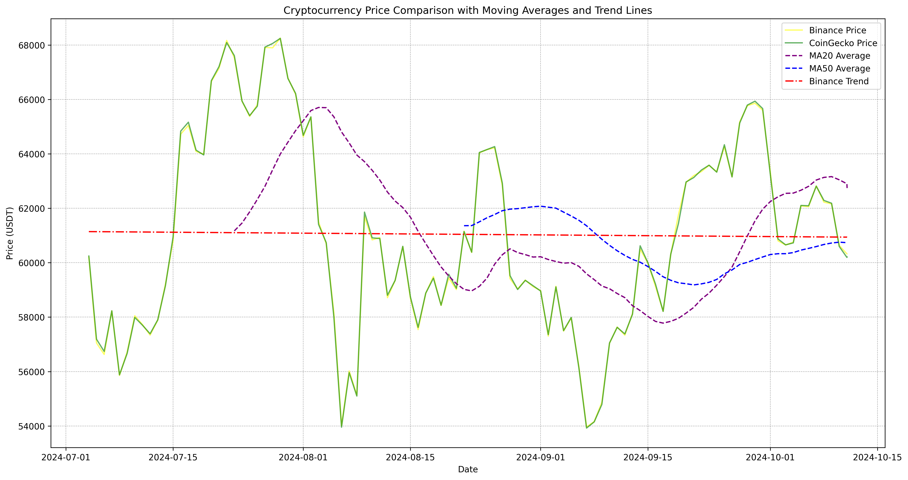

# Cryptocurrency Price Analysis Tool

This Python script fetches cryptocurrency price data from Binance and CoinGecko APIs, analyzes it using moving averages and trend lines, and generates a visualization of the results.

## Features

- Fetches real-time data from Binance and CoinGecko APIs
- Calculates and plots 20-day and 50-day moving averages
- Generates a trend line based on average prices
- Saves high-resolution plots with timestamps

## Prerequisites

- Python 3.8 or higher
- pip (Python package installer)

## Installation

1. Clone the repository:
```bash
git clone https://github.com/yourusername/your-repo-name.git
cd your-repo-name
```

2. Install required packages:
```bash
pip install -r requirements.txt
```

## Usage

Run the script:
```bash
python main.py
```

The script will:
1. Fetch cryptocurrency price data
2. Generate a plot with price data, moving averages, and a trend line
3. Display the plot
4. Save the plot as a PNG file with a timestamp

## Output

The script generates:
- A real-time plot displayed on screen
- A saved PNG file named `CRYPTO_analysis_YYYYMMDD_HHMMSS.png`

## Configuration

By default, the script analyzes BTC/USDT. To analyze different pairs, modify the following variables in `main()`:
- `symbol = "BTCUSDT"` (for Binance)
- `symbol_id = "bitcoin"` (for CoinGecko)

The script uses a config.json file to configure parameters such as moving averages, coins, and date range. Here’s an example config.json file:
```json

{
    "moving_averages": {
        "short_term": 20,
        "long_term": 50
    },
    "coins": {
        "BTCUSDT": "bitcoin",
        "ETHUSDT": "ethereum",
        "XRPUSDT": "ripple"
    },
    "date_range": {
        "days": 100
    }
}
```

By default, the script analyzes BTC/USDT. To analyze different pairs, modify the coins section in config.json.
## Sample Output



## Contributing

Pull requests are welcome.

## License

[MIT](https://choosealicense.com/licenses/mit/)
